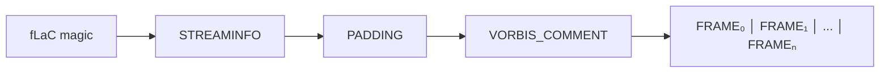
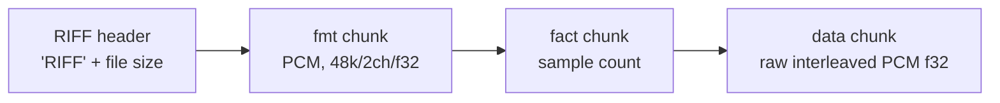
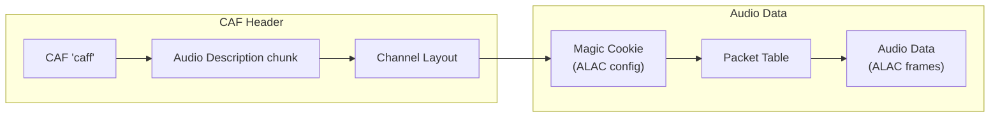
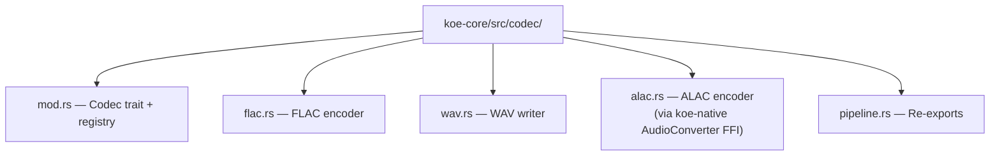

# 11 — Data Formats

## Audio Output Formats

Three output formats, selected via `--format <FORMAT>`:

| Format | Extension | Compression | Container | Metadata Support |
|--------|-----------|-------------|-----------|-----------------|
| **FLAC** (default) | `.flac` | Lossless (~50–60% of raw PCM) | Native FLAC | Vorbis Comment |
| **WAV** | `.wav` | None (raw PCM) | RIFF/WAVE | RIFF INFO chunks |
| **ALAC** | `.m4a` / `.caf` | Lossless (~50–60% of raw PCM) | MPEG-4 / CAF | iTunes metadata |

### Canonical PCM Specification

All encoders receive the same input:

| Property | Value |
|----------|-------|
| Sample rate | 48,000 Hz |
| Bit depth | 32-bit float (f32) |
| Channels | 2 (stereo, interleaved L/R) |
| Byte order | Native endian (little-endian on Apple Silicon) |

Encoders handle conversion to their target format (FLAC → i16/i24, ALAC →
i16, WAV → user-configured bit depth).

### FLAC Details



- **Compression level:** 5 (default; balances speed and ratio)
- **Block size:** 4096 samples (~85 ms at 48 kHz)
- **Bits per sample:** 24 (converted from f32; preserves full dynamic range)
- **Vorbis Comment tags written:**

| Tag | Source |
|-----|--------|
| `TITLE` | `{app_name} recording — {date} {time}` |
| `ARTIST` | `Koe` |
| `DATE` | ISO 8601 recording start |
| `DESCRIPTION` | `Source: {source_config}, Locale: {locale}` |
| `ENCODER` | `koe v{version}` |
| `KOE_SOURCE` | JSON of `AudioSourceConfig` |

### WAV Details



- **Fact chunk** is always written (required for non-PCM or to satisfy tools).
- **No size limit** in v1 (WAV format's 4 GB limit via RIFF64 not implemented;
  users recording > ~6 hours at 48 kHz stereo f32 should use FLAC).

### ALAC Details

ALAC (Apple Lossless Audio Codec) via `AudioConverter` with
`kAudioFormatAppleLossless`. Encoded in a Core Audio Format (`.caf`) container:



- Output: `.caf` with ALAC codec
- **Why CAF not M4A:** Avoids the MPEG-4 container dependency (requires
  `AVAssetWriter`, async, heavier). CAF is simpler and natively supported by
  Core Audio.

### Encoder Crate



```rust
pub trait AudioEncoder: Send {
    fn encode(&mut self, pcm: &[f32]) -> Result<Vec<u8>, CodecError>;
    fn finalize(&mut self) -> Result<Vec<u8>, CodecError>;
    fn format(&self) -> OutputFormat;
    fn sample_rate(&self) -> u32;
    fn channel_count(&self) -> u16;
}

pub enum OutputFormat {
    Flac { compression_level: u8 },
    Wav { bits_per_sample: u16 },
    Alac,
}
```

## Transcript Output Formats

Four format options, selected via `--transcript-format <FORMAT>`:

### TXT (Plain Text)

```
This is the first utterance.
This is the second utterance.
```

- No timestamps, no speaker labels.
- One line per finalized segment.
- Partial segments are not written (only in-memory/on-screen).

### SRT (SubRip)

```srt
1
00:00:01,250 --> 00:00:04,800
This is what was spoken in the first utterance.

2
00:00:05,100 --> 00:00:09,200
This is the second utterance, which is longer.
```

- Timestamps use recording-relative time (not wall clock).
- Segment index is sequential.
- Milliseconds precision.

### VTT (WebVTT)

```vtt
WEBVTT

1
00:00:01.250 --> 00:00:04.800
This is what was spoken in the first utterance.

2
00:00:05.100 --> 00:00:09.200
This is the <i>second</i> utterance, which is longer.
```

- Same timestamp model as SRT.
- Optional styling cues (italic for partial segments in final output? No — partial
  segments are excluded from VTT; only finalized segments).
- WEBVTT header line.

### JSON (Structured)

```json
{
  "format": "koe-transcript",
  "version": 1,
  "locale": "en-US",
  "created_at": "2025-08-10T15:30:00+09:00",
  "source": {
    "type": "system",
    "app_bundle_id": "com.google.Chrome"
  },
  "segments": [
    {
      "index": 0,
      "start_ms": 1250,
      "end_ms": 4800,
      "text": "This is what was spoken in the first utterance.",
      "confidence": 0.95
    },
    {
      "index": 1,
      "start_ms": 5100,
      "end_ms": 9200,
      "text": "This is the second utterance, which is longer.",
      "confidence": 0.92
    }
  ]
}
```

## Transcript Formatter Trait

```rust
pub trait TranscriptFormatter: Send {
    /// Write a finalized segment.
    fn write_segment(&mut self, segment: &TranscriptionSegment);

    /// Get the in-progress output (for CLI preview / GUI live view).
    fn current_output(&self) -> String;

    /// Finalize and return the complete output.
    fn finalize(self) -> String;
}
```

## File Naming Convention

Default output file names when `--output` is not specified:

```
{output_directory}/{app_name}_{date}_{time}.{ext}

Examples:
~/Recordings/Koe/Google Chrome_2025-08-10_153000.flac
~/Recordings/Koe/Google Chrome_2025-08-10_153000.srt
```

When `--output` is a directory, the default name is used within that directory.
When `--output` is a full path, it is used as-is.

## File Size Estimates

| Duration | FLAC (stereo speech) | WAV (f32 stereo) | Transcript (SRT) |
|----------|---------------------|-------------------|-------------------|
| 10 min | ~35 MB | ~345 MB | ~20 KB |
| 30 min | ~105 MB | ~1.0 GB | ~60 KB |
| 1 hour | ~210 MB | ~2.1 GB | ~120 KB |
| 2 hours | ~420 MB | ~4.1 GB | ~240 KB |

**Disk space check:** Before recording starts, Koe checks available disk
space on the output volume. If free space < estimated size × 2, it warns the
user (CLI: stderr warning; GUI: banner). If free space < estimated size, it
refuses to start.
